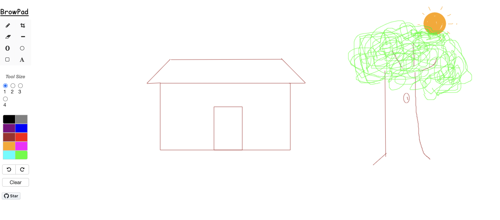

A very simple paint application in the browser.
Created with HTML5 Canvas.

https://bnjasim.github.io/browpad

Requirements:
Canvs HTML5 supported browser (check: http://caniuse.com/#feat=canvas)

### Todo
- Save drawing to local computer
- Open JPEG or PNG images in the application
- Copy & paste selections
- keyboard shortcuts for undo and redo
